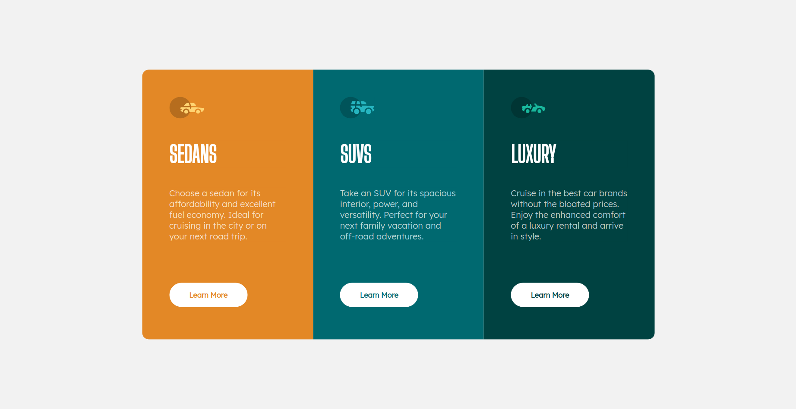
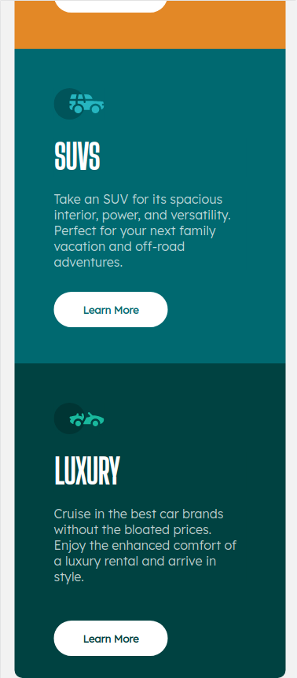

# Frontend Mentor - 3-column preview card component solution

This is a solution to the [3-column preview card component challenge on Frontend Mentor](https://www.frontendmentor.io/challenges/3column-preview-card-component-pH92eAR2-). Frontend Mentor challenges help you improve your coding skills by building realistic projects. 

## Table of contents

- [Overview](#overview)
  - [The challenge](#the-challenge)
  - [Screenshot](#screenshot)
  - [Links](#links)
- [My process](#my-process)
  - [Built with](#built-with)
  - [What I learned](#what-i-learned)
  - [Useful resources](#useful-resources)

## Overview

### The challenge

Users should be able to:

- View the optimal layout depending on their device's screen size
- See hover states for interactive elements

### Screenshot

        

### Links

- Solution URL: [solution URL](https://www.frontendmentor.io/solutions/3column-preview-card-using-html-and-css-yoa0GQnb1I)

## My process

### Built with

- Semantic HTML5 markup
- CSS custom properties
- Flexbox
- CSS responsive

### What I learned

I learned how to use flexbox to arrange multiple eliments in a container. also learned to make website responsive using media queries.

### Useful resources

- [html resource](https://www.w3schools.com/html/) 
- [css resource](https://www.w3schools.com/css/) 
